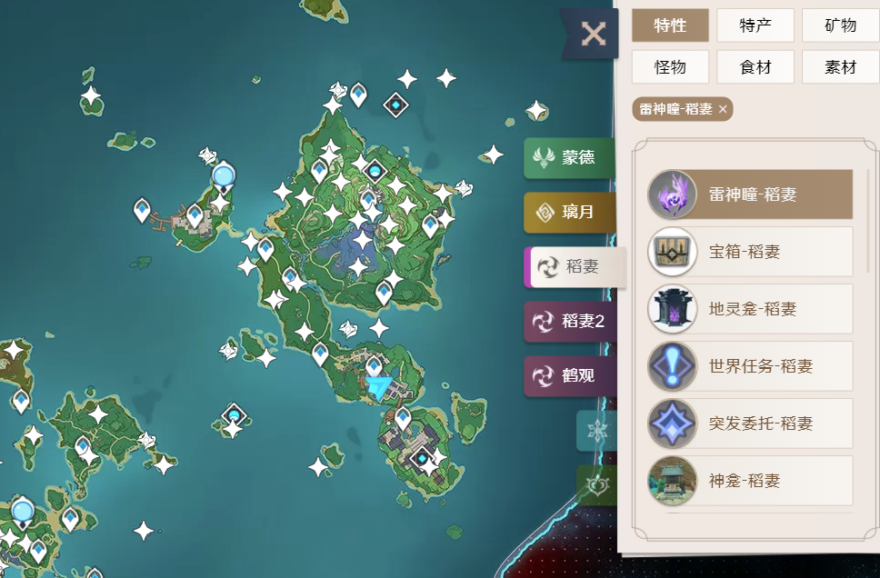

# 原神地图跟踪

* 功能：网页空莹酒馆地图与游戏玩家位置同步跟踪
  

地图目前支持区域：

| 蒙德 | 雪山 | 璃月 | 稻妻I | 稻妻II() | 稻妻III(鹤观) |

- 本项目借游戏画面的窗口截图进行图像处理算法以实现所有功能，其不会对游戏内存进行读写，因而不会有封号的风险，但效果也因此具备一定的局限。
- 项目仅在有限的条件下测试过，如需排查错误，强烈建议按照以下描述进行环境配置。
  - 原神客户端 > 右上角派蒙 > 设置 > 抗锯齿，设置为 `SMAA`
  - 原神客户端 > 右上角派蒙 > 设置 > 分辨率，设置为 `1920x1080`

# 该项目离不开以下项目的支持：
* https://github.com/GengGode/GenshinImpact_AutoTrack_DLL
